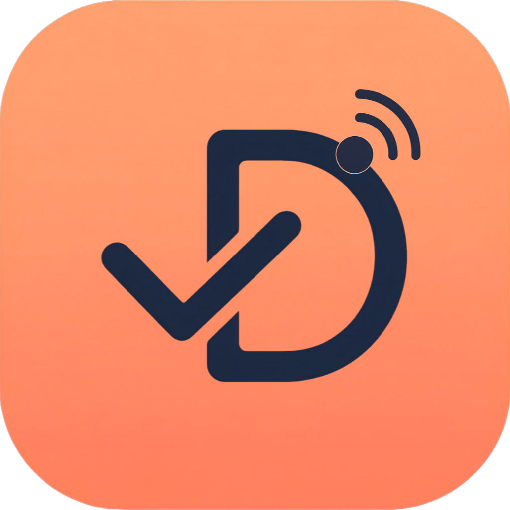
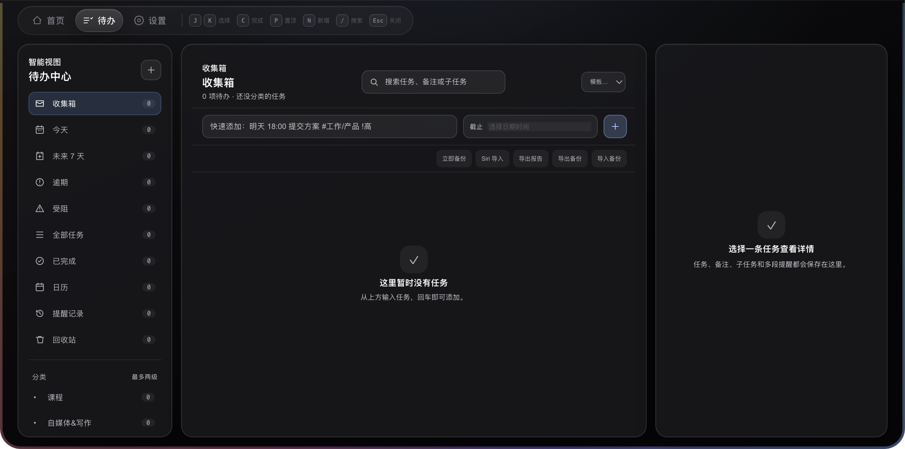
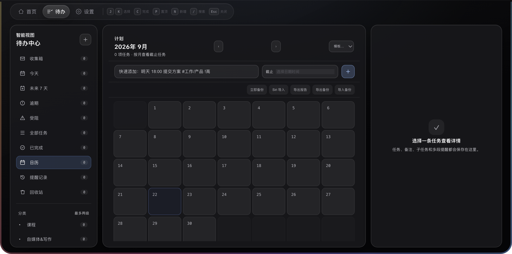
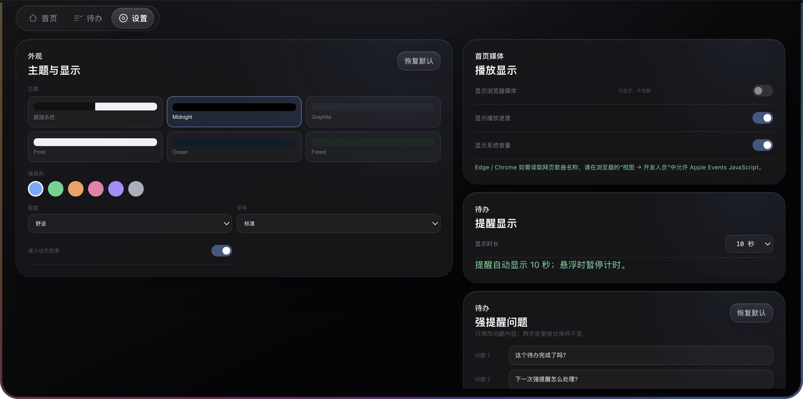

<div align="center">
  
  <h1>叮做 · Dingdo</h1>
  <p><strong>开源、本地优先的 macOS 刘海待办与 Windows 桌面提醒工具。</strong></p>
  <p>
    <a href="https://github.com/zxc19950223/Dingdo/releases/latest"><strong>下载 macOS 版</strong></a>
    ·
    <a href="https://github.com/zxc19950223/Dingdo/releases/latest"><strong>下载 Windows 版</strong></a>
    ·
    <a href="#从源码运行">从源码运行</a>
    ·
    <a href="#更新日志">更新日志</a>
  </p>
  <p>
    
    
    
    
  </p>
</div>

叮做（Dingdo）是一个常驻 macOS / Windows 屏幕顶部的开源待办、提醒和日历工具。它可以显示为 macOS 刘海位置的单色胶囊，也可以显示为 Windows 顶部的贴顶胶囊；点击后展开完整的待办面板。

核心能力围绕待办管理、强提醒、日历视图、Siri 提醒事项导入、桌面小组件和音乐播放信息展示，不要求账号，不依赖云端服务。

**Dingdo** is an open-source, local-first todo and reminder app for macOS and Windows. It lives near the MacBook notch or at the top of the Windows desktop, with strong reminders, a calendar view, Siri Reminders import, desktop widgets, local storage, and media playback information. No account or cloud service is required.

## 界面预览

> 以下截图使用内置演示数据生成，不包含真实用户待办。








## 待办

- 支持大类和小类两级名录，可调整名称、顺序和提醒默认值。
- 每条待办支持截止时间、优先级、备注、标签、置顶和重复规则。
- 支持子任务和完成进度，可以在列表中直接展开查看。
- 支持待办、进行中、受阻和已完成状态。
- 受阻任务需要记录原因类型、具体说明和下一步计划。
- 支持今天、未来 7 天、逾期、受阻、全部、已完成和历史记录等智能视图。
- 支持搜索、筛选、排序、批量选择、模板和回收站。
- 活动记录会保留创建、改期、提醒触发、稍后处理、完成和恢复等操作。
- 支持导出当前待办或当前名录及子名录，生成 Word `.docx` 或 PDF 文件。
- 重要任务可以发送到桌面卡片，并在桌面直接完成或打开详情。

## 提醒

普通提醒支持多个提前时间，可同时选择：

- 到期时
- 提前 1 分钟
- 提前 10 分钟
- 提前 1 小时
- 提前 1 天
- 自定义分钟数

普通提醒显示时长可以在设置中改为 3、5、10、15、30 秒或不自动收起。提醒弹出后没有处理的待办会显示红色“提醒未处理”状态；打开详情、完成、稍后或顺延后清除。

选择稍后提醒时，任务时间会真实顺延，并清理同一任务已经排队的旧提醒，避免反复弹出。

### 强提醒

强提醒适合真正重要、必须处理的任务。应用可以先显示风险确认，并把强提醒时间与任务截止时间分开设置。

强提醒时间不能晚于任务截止时间。到点后会全屏弹出强制问答：

1. 待办是否已经完成。
2. 未完成时，选择保持原时间、修改时间或停止后续提醒。

选择已完成时，必须再次确认，避免误点。

## 每日收尾

可以设置每天的收尾时间。到点后会汇总当天：

- 已完成
- 新增
- 未完成
- 逾期
- 已触发提醒
- 顺延任务

未完成任务可以真实移到明天、统一改到明天 09:00，或选择晚于当前时间的自定义时间。

## Siri 与系统提醒事项

叮做支持从 macOS「提醒事项」单向导入 Siri 创建的待办：

1. 在系统「提醒事项」中建立或选择目标列表。
2. 使用 Siri 把事项加入该列表。
3. 在叮做中选择提醒列表和导入分类。
4. 手动导入，或开启每 15 秒自动检查。

导入会按系统提醒 ID 去重。同步成功后，折叠胶囊下方会短暂显示同步条数和任务名称。叮做会在启动时静默准备提醒事项进程，读取时不会主动把提醒窗口切到前台。

## 顶部胶囊与音乐

- macOS 折叠态位于物理刘海位置，Windows 折叠态位于屏幕顶部。
- 音乐播放时，胶囊左侧显示封面，右侧显示节奏线。
- 音乐开始播放或换歌时，胶囊会短暂向下展开显示歌曲和来源。
- 播放中鼠标悬浮可保持展开；移开后约 2.8 秒收回。
- 空闲时显示会跟随鼠标、自动眨眼和环视的眼睛，嘴巴会持续缓慢张合。
- 网易云音乐和浏览器媒体可以显示播放信息；浏览器媒体当前以读取和展示为主。

## 数据与隐私

- 不要求注册账号。
- 没有云端后端，不上传待办内容。
- 待办、设置、模板和活动记录默认保存在本机。
- 可以手动备份、导入和导出工作区数据。
- Siri 导入只读取用户指定的提醒列表。
- API Key 使用系统安全存储加密，渲染页面无法读取明文。

## 下载与安装

> 当前稳定版本：**2.0.0** · **macOS 13+ Apple Silicon** / **Windows 10/11 x64**

| 平台 | 下载 |
| --- | --- |
| macOS | [Dingdo-2.0.0-arm64.dmg](https://github.com/zxc19950223/Dingdo/releases/download/v2.0.0/Dingdo-2.0.0-arm64.dmg) |
| Windows | [Dingdo-2.0.0-windows-x64-setup.exe](https://github.com/zxc19950223/Dingdo/releases/download/v2.0.0/Dingdo-2.0.0-windows-x64-setup.exe) |

### macOS

1. 打开 DMG，将 `叮做.app` 拖入「应用程序」。
2. 首次启动若被系统拦截，前往「系统设置 → 隐私与安全性」点击「仍要打开」。
3. 根据需要授予提醒事项、辅助功能、屏幕录制、摄像头或麦克风权限。

macOS 安装包采用 ad-hoc 签名，不进行 Apple 公证。重新打包后，系统可能要求重新授权。

### Windows

1. 运行 `Dingdo-*-windows-x64-setup.exe`。
2. 默认安装到当前用户目录，不需要管理员权限。
3. 首次运行可能出现 SmartScreen 提示，可核对文件来源和 SHA-256 后继续。

## 从源码运行

要求 Node.js 22.12.0 或更高版本：

```bash
git clone https://github.com/zxc19950223/Dingdo.git
cd Dingdo
npm install
npm test
npm start
```

常用命令：

| 命令 | 用途 |
| --- | --- |
| `npm test` | 运行完整测试 |
| `npm start` | 启动开发版 |
| `npm run pack` | 生成未安装的 macOS `.app` |
| `npm run build` | 生成 Apple Silicon DMG |
| `npm run build:win` | 生成 Windows x64 安装包 |
| `npm run screenshots` | 使用隔离演示数据重新生成 README 截图 |

## 演示截图

仓库提供固定的演示数据和截图脚本：

```text
docs/demo/demo-profile.js
scripts/capture-demo-screenshots.js
```

截图流程只使用临时 profile，不会读取真实待办，也不会截取桌面或其他应用窗口。

## 项目结构

```text
.
├── main.js
├── main-services.js
├── preload.js
├── renderer/
├── report-export.js
├── tests/
├── docs/
├── scripts/
└── build/
```

## 更新日志

当前稳定版本为 **v2.0.0**。完整版本历史见 [CHANGELOG.md](CHANGELOG.md)。

## License

[MIT](LICENSE)

本项目基于一个 MIT 许可的开源项目持续改造。原始版权和许可条款保留在 [LICENSE](LICENSE) 中。
